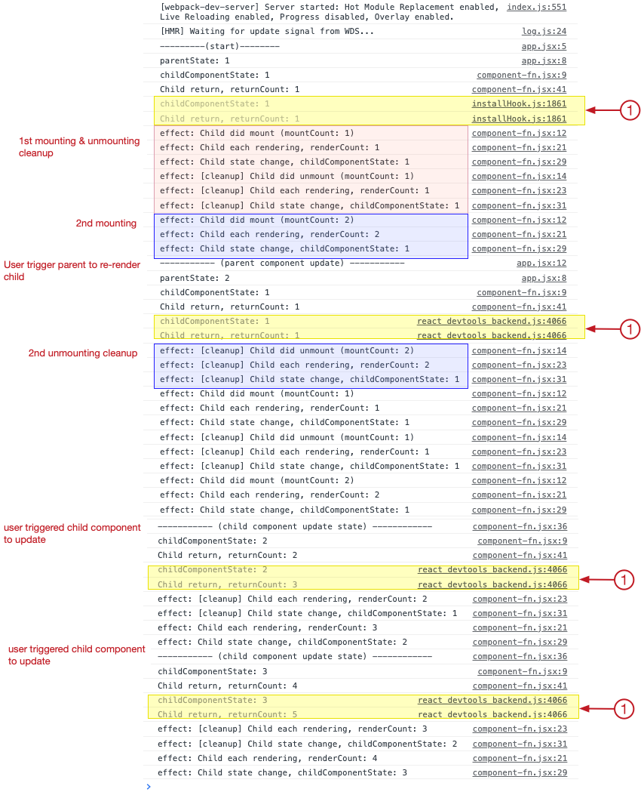

**Observation:**

- All effects in a component  will execute twice when the component remount. 
- The clean up of effects of second execution occurs after remount.
- This double execution does not happen when the component internal state change  (i.e., `useState` is called). 

screenshot: console output

- I am not sure why the return of function component (file: src/component-fn.jsx line 21) run twice even the component is not remounting (noted by (3) above). They are created from  `react devtools backend.js 4066`. More investigation and reading is required. See: [Why is console.log() showing react_devtools_backend.js:4049 instead of the file and line number?](https://stackoverflow.com/questions/69071151/why-is-console-log-showing-react-devtools-backend-js4049-instead-of-the-file)

- Not sure what is `installHook.js 1861` (noted by (1) above).

